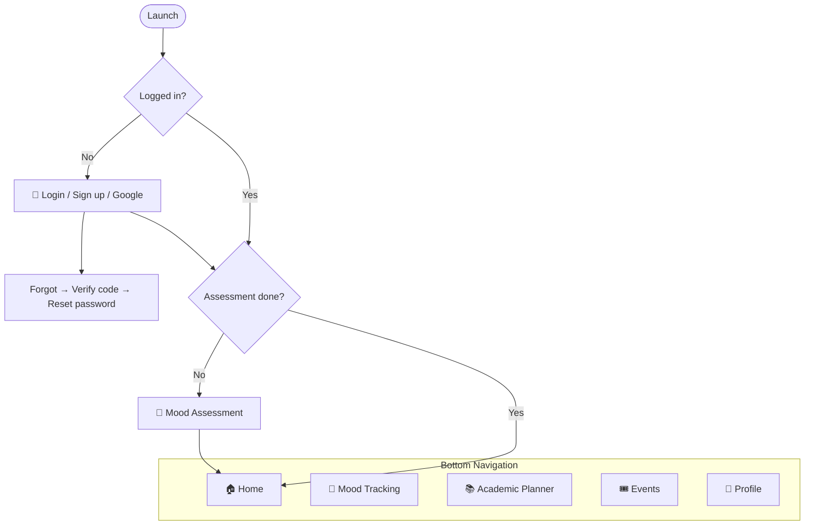
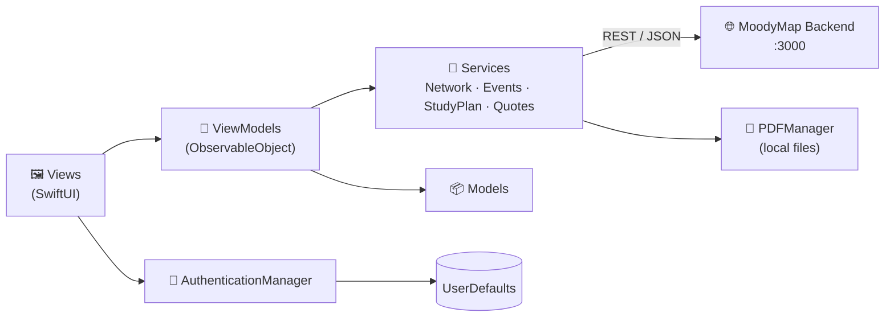

<div align="center">

# 🗺️ MoodyMap — iOS

**A student wellbeing app that turns how you feel into a plan for your day.**

Detect your mood · understand your patterns · study smarter · find events that lift you up


</div>

---

## 📖 Table of Contents

- [Overview](#-overview)
- [Features](#-features)
- [App Flow](#-app-flow)
- [Architecture](#-architecture)
- [Tech Stack](#-tech-stack)
- [Project Structure](#-project-structure)
- [Getting Started](#-getting-started)
- [Backend API](#-backend-api)

---

## 🌟 Overview

**MoodyMap** helps students look after their mental wellbeing alongside their studies. A short questionnaire builds a profile of each student. After that, the app detects their mood from a selfie, tracks it over time, and uses it to suggest a **study plan** and **events** that suit how they feel.

This repository contains the native **SwiftUI iOS app**. It talks to the MoodyMap REST backend.

---

## ✨ Features

| | Feature | Description |
|---|---|---|
| 🔐 | **Authentication** | Email sign-up and login, Google Sign-In, *Remember me*, and password reset with a verification code |
| 📝 | **Mood assessment** | Onboarding questionnaire that scores answers and assigns a **user type** |
| 📸 | **Emotion detection** | Take or pick a photo, and the AI detects your emotion and returns an emoji and advice |
| 📊 | **Mood analytics** | Charts and stats of your emotions over time |
| 📚 | **Academic planner** | Generates a **personalized study plan** from your profile, current emotion, and exam date, exportable as a PDF |
| 🎟️ | **Events** | Browse events, see capacity, **participate**, and download a **voucher** |
| ⭐ | **Daily recommendations** | Recommended events and a motivational quote of the day |
| 🏠 | **Home dashboard** | Welcome banner, daily motivation, mood stats, study progress, and notifications |
| 👤 | **Profile** | Edit your details and profile picture |
| 🌗 | **Themes & languages** | Light and dark themes, plus English and French localization |

---

## 🧭 App Flow



---

## 🏗 Architecture

The app follows **MVVM**: SwiftUI views bind to `ObservableObject` view models, which call service classes that use `URLSession` with `async/await`.



---

## 🛠 Tech Stack

| Purpose | Technology |
|---|---|
| Language | Swift 5 |
| UI | SwiftUI, Swift Charts |
| Architecture | MVVM with `ObservableObject` and `@Published` |
| Networking | `URLSession` with `async/await` |
| Authentication | Email/password, [GoogleSignIn-iOS](https://github.com/google/GoogleSignIn-iOS) (Swift Package Manager) |
| Persistence | `UserDefaults`, Core Data |
| Media | `UIImagePickerController` (camera and photo library) |
| Localization | String Catalog (`Localizable.xcstrings`): English and French |
| Minimum OS | iOS 17 |

---

## 📂 Project Structure

```
FrontIOS/
├── FrontIOSApp.swift            # App entry point
├── ContentView.swift            # Root routing (auth → assessment → tabs)
├── Views/                       # Screens: Login, SignUp, Home, MoodTracking,
│                                #   MoodAssessment, AcademicPlanner, Events, Profile…
├── View Models/                  # One ViewModel per screen
├── Models/                      # Auth, Mood, Event, StudyPlan, Theme…
├── Services/                    # Network, Auth manager, Events, StudyPlan,
│                                #   Quotes, Recommendations, PDF, Tasks
├── Components/                  # Reusable UI: charts, cards, nav bar, banners…
├── Localizable.xcstrings        # EN / FR translations
└── Assets.xcassets              # Icons, logos, colors
FrontIOSTests/                   # Unit tests
FrontIOSUITests/                 # UI tests
```

---

## 🚀 Getting Started

### Prerequisites

- macOS with **Xcode 15** or later
- An iOS 17 simulator or device
- The **MoodyMap backend** running and reachable on port `3000`

### 1. Clone

```bash
git clone https://github.com/achreflajmi/FinalMoodyMap.git
cd FinalMoodyMap
```

### 2. Open in Xcode

```bash
open FrontIOS.xcodeproj
```

Xcode fetches **GoogleSignIn-iOS** automatically through Swift Package Manager.

### 3. Point the app at your backend

The backend address is set as `baseURL` in the services and view models (default `http://172.18.25.95:3000`). Replace it with your server's address:

- `Services/NetworkService.swift`
- `Services/EventService.swift`
- `Services/StudyPlanService.swift`
- `Services/QuoteService.swift`
- `Services/EventRecommendationService.swift`
- `View Models/` (mood tracking and assessment)

> **Tip**
> On the simulator, `http://localhost:3000` reaches a backend running on your Mac. On a real device, use your Mac's local IP address.

### 4. Run

Select the **FrontIOS** scheme and a simulator, then press **⌘R**.

---

## 📡 Backend API

Endpoints the app calls:

<details>
<summary><b>🔐 Auth</b> · <code>/auth</code></summary>

| Method | Endpoint | Purpose |
|---|---|---|
| `POST` | `/auth/signup` | Create an account |
| `POST` | `/auth/login` | Log in |
| `POST` | `/auth/google-signin` | Log in with Google |
| `GET` | `/auth/get-user-id?email=` | Find a user ID by email |
| `POST` | `/auth/forgot-password` | Send a reset code |
| `POST` | `/auth/verify-code/{userId}` | Verify the reset code |
| `POST` | `/auth/reset-password/{userId}` | Set a new password |
| `GET` | `/auth/user-details` | Current user profile |
| `PUT` | `/auth/edit-profile` | Update the profile |
| `POST` | `/auth/submit-assessment` | Save the assessment result and user type |

</details>

<details>
<summary><b>😊 Mood & Wellbeing</b></summary>

| Method | Endpoint | Purpose |
|---|---|---|
| `POST` | `/emotion/detect` | Detect emotion from a photo |
| `GET` | `/emotion/stats` | Mood statistics |
| `POST` | `/study-plan` | Generate a study plan (`userType`, `emotion`, `examDate`) |
| `GET` | `/quotes/daily` | Quote of the day |

</details>

<details>
<summary><b>🎟️ Events</b> · <code>/events</code></summary>

| Method | Endpoint | Purpose |
|---|---|---|
| `GET` | `/events` | List events |
| `GET` | `/events/{id}` | Event details |
| `POST` | `/events/{id}/participate` | Join an event |
| `GET` | `/events/{id}/voucher` | Download the participation voucher |
| `GET` | `/events/recommendations/daily` | Daily recommended events |

</details>

---

<div align="center">

Made with ❤️ for students who deserve to feel good while they learn.

</div>
